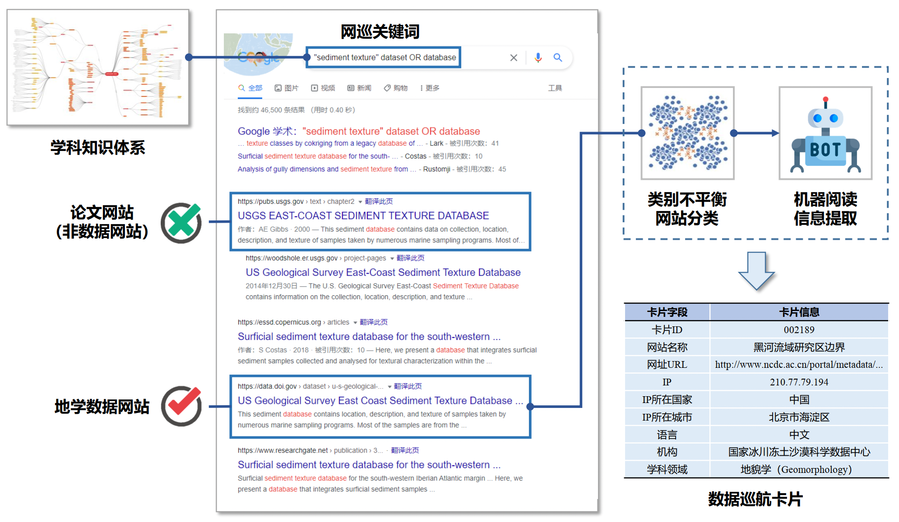

# Bin Lu's homepage

## Biography
I'm currently a PhD student in [IIOT Research Center](http://iiot.sjtu.edu.cn/) at [Shanghai Jiao Tong University](http://en.sjtu.edu.cn/), advised by Professor [Xiaoying Gan](https://iiot.sjtu.edu.cn/#/xygan) and Professor [Xinbing Wang](https://www.cs.sjtu.edu.cn/~wang-xb/). I received bachelor from Shanghai Jiao Tong University with honors in July 2020 and was recommended for the master degree from Sepetember 2020. Additionally, I transfer to be a PhD student (硕博连读) in March, 2022. My research fields now are graph mining, few-shot learning, spatial-temporal data mining.

## Publications

- \[KDD 2022\] Geometer: Graph Few-Shot Class-Incremental Learning via Prototype Representation [\[arxiv\]](https://arxiv.org/abs/2205.13954)[\[code\]](https://github.com/RobinLu1209/Geometer)
 
  **Bin Lu**, Xiaoying Gan, Lina Yang, Weinan Zhang, Luoyi Fu, Xinbing Wang
  
  ACM SIGKDD Conference on Knowledge Discovery and Data Mining, 2022. (CCF-A)

- \[KDD 2022\] Spatio-Temporal Graph Few-Shot Learning with Cross-City Knowledge Transfer [\[arxiv\]](https://arxiv.org/abs/2205.13947)[\[code\]](https://github.com/RobinLu1209/ST-GFSL)

  **Bin Lu**, Xiaoying Gan, Weinan Zhang, Huaxiu Yao, Luoyi Fu, Xinbing Wang
  
  ACM SIGKDD Conference on Knowledge Discovery and Data Mining, 2022. (CCF-A)
 
- \[ACM TIST 2022\] Make More Connections: Urban Traffic Flow Forecasting with Spatiotemporal Adaptive Gated Graph Convolution Network [\[paper\]](https://dl.acm.org/doi/10.1145/3488902)

  **Bin Lu**, Xiaoying Gan, Haiming Jin, Luoyi Fu, Xinbing Wang, Haisong Zhang
  
  ACM Transactions on Intelligent Systems and Technology, 2022. (SCI，交大A类期刊，IF=4.654)

- \[CIKM 2020\] Spatiotemporal Adaptive Gated Graph Convolution Network for Urban Traffic Flow Forecasting [\[paper\]](https://dl.acm.org/doi/10.1145/3340531.3411894)[\[code\]](https://github.com/RobinLu1209/STAG-GCN)[\[slide\]](https://github.com/RobinLu1209/robinlu1209.github.io/raw/master/files/CIKM_fp0393_PPT.pdf) 

  **Bin Lu**, Xiaoying Gan, Haiming Jin, Luoyi Fu, Haisong Zhang
  
  ACM International Conference on Information and Knowledge Management, 2020. (CCF-B, included in open-source project [LibCity](https://github.com/LibCity/Bigscity-LibCity))

## Project

**DDE DataStore -- Deep-time Digital Earth (DDE) Program** The [Deep-time Digital Earth (DDE) Program](https://www.ddeworld.org/) is the first 'big science program' initiated by the International Union of Geological Sciences (IUGS) that will provide new opportunities and directions for the development of Earth Sciences. DDE DataStore is an important component of Deep-time Digital Earth (DDE) Program, aiming to discover and integrate global geological data. At present, DDE DataStore has obtained more than 1 million websites based on 15,000 keywords and found more than 10,000 geological data.[\[website\]](https://datastore.acemap.info/#/)

## Awards
- **National Scholarship** (国家奖学金). 2021
- Outstanding Teaching Assistant Award, Center for Teaching and Learning Development of SJTU. 2021
- **Shanghai Honor Graduates** (上海市优秀毕业生), SJTU. 2020
- ACM SIGIR Student Travel Grant for CIKM, ACM SIGIR. 2020
- Excellent Intern, Intel Asia-Pacific Research \& Development Ltd., 2019

## Competitions
- First Prize, National University Internt of Things (IoT) Design Competition, supervised by Professor Xiaoying Gan. 2021 [NEWS](https://news.sjtu.edu.cn/jdyw/20210927/158841.html)
- Meritorious Winner, Mathematical Contest in Modeling, COMAP, supervised by Professor [Xiaofeng Gao](http://www.cs.sjtu.edu.cn/~gao-xf/). 2019
- First Prize, National University Internt of Things(IoT) Design Competition, supervised by Senior-Engineer Jimin Xu and Associate Professor [Haiming Jin](http://jhc.sjtu.edu.cn/~haimingjin/). 2019

## Professional Activities
### Journal Reviewer
- China Communications (《中国通信》英文版)
- Financial Innovation
- Physica A: Statistical Mechanics and its Applications

## Misc
- Teaching assistant of EE234 Communication Theory (2020, 2021), ES342 RF Microelectronics (2021,2022) with [excellent awards](http://ctld.sjtu.edu.cn/news/811).

## Contact
Room 441, SEIEE Building No.1, Dongchuan Road 800, Shanghai, China
Email: robinlu1209 at sjtu dot edu dot cn

