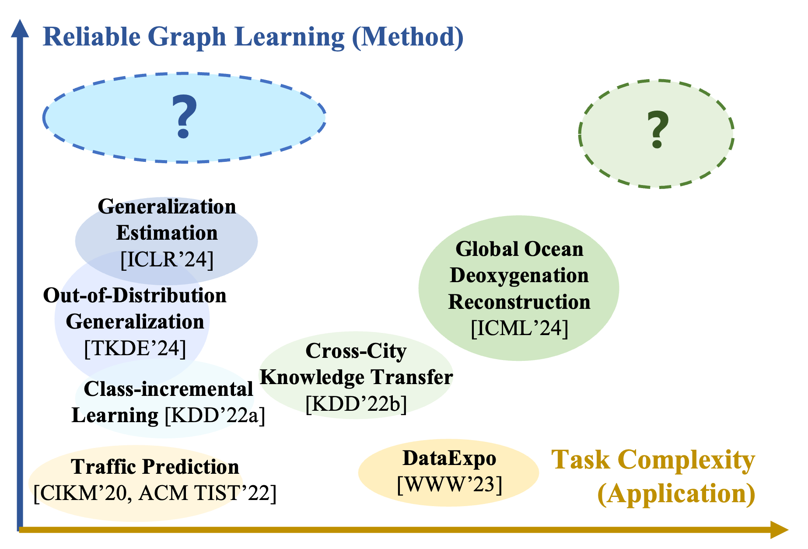
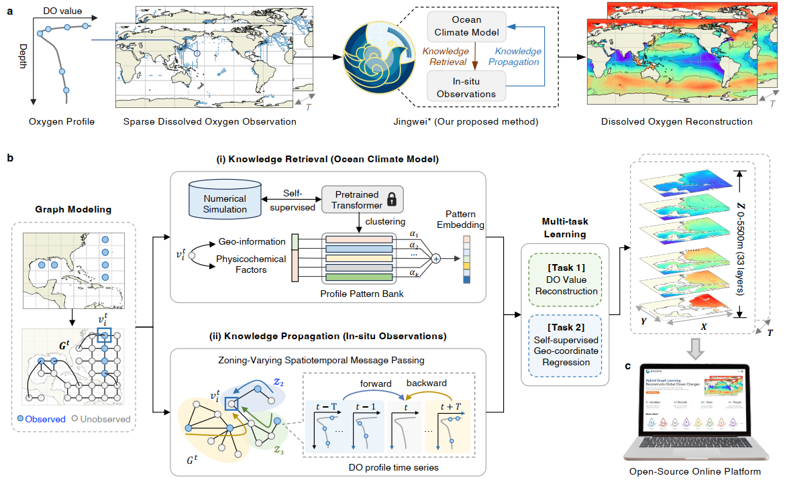

# Bin Lu's homepage

## Biography
I'm currently a postdoctoral researcher in [IIOT Research Center](http://iiot.sjtu.edu.cn/) at [Shanghai Jiao Tong University](http://en.sjtu.edu.cn/). I obtained PhD degree from the Department of Electronic Engineering at Shanghai Jiao Tong University in March 2025, supervised by Professor [Xiaoying Gan](https://iiot.sjtu.edu.cn/#/xygan) and Professor [Xinbing Wang](https://www.cs.sjtu.edu.cn/~wang-xb/). I received bachelor from Shanghai Jiao Tong University with honors in July 2020.

My current *research interests* focus on revealing heterogeneous structure of ubiquitous entities and discovering underlying knowledge with machine learning techniques.
- **Graph Mining**: Representation, Transfer and Generalization on Graphs
- **AI for Science**: GeoAI, Urban Computing, Open Scientific Data

## Publications
**[\[ICML 2024\]](https://proceedings.mlr.press/v235/lu24n.html)  OxyGenerator: Reconstructing Global Ocean Deoxygenation Over a Century with Deep Learning** [\[ICLR Workshop 2024\]](https://www.climatechange.ai/events/iclr2024)[\[EGU\]](https://meetingorganizer.copernicus.org/EGU24/EGU24-5926.html)[\[Dataset\]](https://msdc.qdio.ac.cn/data/metadata-special-detail?id=1923297698308493313&otherId=1923297698316881921)\
**Bin Lu**, Ze Zhao, Luyu Han, Xiaoying Gan, Yuntao Zhou, Lei Zhou, Luoyi Fu, Xinbing Wang, Chenghu Zhou, Jing Zhang\
International Conference on Machine Learning, 2024. (CCF-A)

**[\[TKDE 2024\]](https://ieeexplore.ieee.org/document/10517351) Graph Out-of-Distribution Generalization with Controllable Data Augmentation**\
**Bin Lu**, Ze Zhao, Xiaoying Gan, Shiyu Liang, Luoyi Fu, Xinbing Wang, Chenghu Zhou\
IEEE Transactions on Knowledge and Data Engineering, 2024. (CCF-A)

**[\[ICLR 2024\]](https://openreview.net/forum?id=HFtrXBfNru) Temporal Generalization Estimation in Evolving Graphs** [\[paper\]](https://openreview.net/forum?id=HFtrXBfNru)[\[NeurIPS Workshop 2023\]](https://nips.cc/virtual/2023/workshop/66514)\
**Bin Lu**, Tingyan Ma, Xiaoying Gan, Xinbing Wang, Yunqiang Zhu, Chenghu Zhou, Shiyu Liang\
The Twelfth International Conference on Learning Representations, 2024. (Tsinghua-A, the short version is presented in NeurIPS 2023 Workshop on Self-Supervised Learning - Theory and Practice.) 

**[\[WWW 2023\]](https://doi.org/10.1145/3543873.3587305) DataExpo: A One-stop Dataset Service for Open Science Research** [\[demo\]](https://dataexpo.acemap.info/)[\[paper\]](https://doi.org/10.1145/3543873.3587305)\
**Bin Lu**, Lynwen Wu, Lina Yang, Chenxing Sun, Wei Liu, Xiaoying Gan, Shiyu Liang, Xinbing Wang, Chenghu Zhou\
The Web Conference, 2023. (CCF-A)

**[\[KDD 2022\]](https://dl.acm.org/doi/10.1145/3534678.3539280) Geometer: Graph Few-Shot Class-Incremental Learning via Prototype Representation** [\[arxiv\]](https://arxiv.org/abs/2205.13954)[\[code\]](https://github.com/RobinLu1209/Geometer)[\[paper\]](https://dl.acm.org/doi/10.1145/3534678.3539280)[\[slide\]](https://github.com/RobinLu1209/robinlu1209.github.io/raw/master/files/Geometer-PPT.pdf)[\[poster\]](https://github.com/RobinLu1209/robinlu1209.github.io/raw/master/files/Geometer-poster.pdf)[\[media\]](https://mp.weixin.qq.com/s/Rbuqlpw5NpBn_5r-GPAJxQ) \
**Bin Lu**, Xiaoying Gan, Lina Yang, Weinan Zhang, Luoyi Fu, Xinbing Wang\
ACM SIGKDD Conference on Knowledge Discovery and Data Mining, 2022. (CCF-A, Oral)

**[\[KDD 2022\]](https://dl.acm.org/doi/10.1145/3534678.3539281) Spatio-Temporal Graph Few-Shot Learning with Cross-City Knowledge Transfer** [\[arxiv\]](https://arxiv.org/abs/2205.13947)[\[code\]](https://github.com/RobinLu1209/ST-GFSL)[\[paper\]](https://dl.acm.org/doi/10.1145/3534678.3539281)[\[slide\]](https://github.com/RobinLu1209/robinlu1209.github.io/raw/master/files/CrossCityTransfer-PPT.pdf)[\[poster\]](https://github.com/RobinLu1209/robinlu1209.github.io/raw/master/files/CrossCityTransfer-poster.pdf)[\[media\]](https://mp.weixin.qq.com/s/80SZUkneAVrcAhs19tx7UA) \
**Bin Lu**, Xiaoying Gan, Weinan Zhang, Huaxiu Yao, Luoyi Fu, Xinbing Wang\
ACM SIGKDD Conference on Knowledge Discovery and Data Mining, 2022. (CCF-A, Oral)
 
**[\[ACM TIST 2022\]](https://dl.acm.org/doi/10.1145/3488902) Make More Connections: Urban Traffic Flow Forecasting with Spatiotemporal Adaptive Gated Graph Convolution Network** [\[paper\]](https://dl.acm.org/doi/10.1145/3488902)\
**Bin Lu**, Xiaoying Gan, Haiming Jin, Luoyi Fu, Xinbing Wang, Haisong Zhang\
ACM Transactions on Intelligent Systems and Technology, 2022. (SCI，SJTU-A，IF=4.654)

**[\[CIKM 2020\]](https://dl.acm.org/doi/10.1145/3340531.3411894) Spatiotemporal Adaptive Gated Graph Convolution Network for Urban Traffic Flow Forecasting** [\[paper\]](https://dl.acm.org/doi/10.1145/3340531.3411894)[\[code\]](https://github.com/RobinLu1209/STAG-GCN)[\[slide\]](https://github.com/RobinLu1209/robinlu1209.github.io/raw/master/files/CIKM_fp0393_PPT.pdf) \
**Bin Lu**, Xiaoying Gan, Haiming Jin, Luoyi Fu, Haisong Zhang\
ACM International Conference on Information and Knowledge Management, 2020. (CCF-B, Oral, included in open-source project [LibCity](https://github.com/LibCity/Bigscity-LibCity))

**[\[ICDE 2025\]]() Numerical Reasoning on Knowledge Graphs: From a Chain Perspective**\
Ze Zhao, **Bin Lu**, Xiaoying Gan, Gu Tang, Luoyi Fu, Xinbing Wang, Chenghu Zhou\
IEEE International Conference on Data Engineering, Hong Kong, China, 2025. (CCF-A)

**[\[KDD 2025\]]() R2MR: Review and Rewrite Modality for Recommendation**\
Gu Tang, Jinghe Wang, Xiaoying Gan, **Bin Lu**, Ze Zhao, Luoyi Fu, Xinbing Wang, Chenghu Zhou\
ACM SIGKDD International Conference on Knowledge Discovery and Data Mining, 2025. (CCF-A)

**[\[Acta Oceanologica Sinica 2025\]]() Reconstruction of dissolved oxygen in the Tropical Pacific Ocean for past 100 years based on XGBoost**\
Jingjing Shen, **Bin Lu**, Lei Zhou, Xiaoying Gan\
Acta Oceanologica Sinica, 2025

**[\[SIGIR 2024\]]() EditKG: Editing Knowledge Graph for Recommendation**\
Gu Tang, Xiaoying Gan, Jinghe Wang, **Bin Lu**, Lyuwen Wu, Luoyi Fu, Chenghu Zhou\
International ACM SIGIR Conference on Research and Development in Information Retrieval, 2024. (CCF-A)

**[\[ICDM 2023\]](https://ieeexplore.ieee.org/document/10415791) Graph Open-Set Recognition via Entropy Message Passing**\
Lina Yang, **Bin Lu**, Xiaoying Gan\
IEEE International Conference on Data Mining, 2023. (CCF-B)

## Project

**DDE DataExpo -- Deep-time Digital Earth (DDE) Program.** The [Deep-time Digital Earth (DDE) Program](https://www.ddeworld.org/) is the first 'big science program' initiated by the International Union of Geological Sciences (IUGS) that will provide new opportunities and directions for the development of Earth Sciences. DDE DataStore is an important component of Deep-time Digital Earth (DDE) Program, aiming to discover and integrate global geological data. At present, DDE DataExpo has obtained more than 1 million websites based on 15,000 keywords and found more than 200,000 geological data.[\[website\]](https://dataexpo.deep-time.org/#/)[\[poster\]](https://github.com/RobinLu1209/robinlu1209.github.io/blob/master/files/datastore-poster.pdf)[\[media\]](https://mp.weixin.qq.com/s/fH28qwZ4HMnOCqsusEXzQg)[\[news\]](https://news.sjtu.edu.cn/jdzh/20221117/176543.html)

**Jingwei - Hybrid Graph Learning Reconstructs Global Ocean Changes.** In this interdisciplinary study, we present a significant achievement in the modeling of ocean deoxygenation, offering accurate, long-term, and global spatiotemporal reconstructions of dissolved oxygen variations through a novel hybrid deep learning framework. We name it [Jingwei](https://en.wikipedia.org/wiki/Jingwei), a mythical bird in Chinese mythology that insist on filling the sea with pebbles and twigs, just as we try to fill the sparse ocean oxygen observations. We believe the approach proposed in this study represents a new AI-driven paradigm in ocean system modeling, with the potential to advance the understanding of deoxygenation mechanisms and provide a pioneering framework for climate change analysis with advanced AI techniques. Alongside, we have released an [open-source platform](https://jingwei.acemap.info/), providing data visualization, resource sharing and ongoing updates to more variables. [\[code\]](https://github.com/RobinLu1209/Jingwei) [\[website\]](https://jingwei.acemap.info/)

## Awards
- **Baidu Fellowship** (10 awardees worldwide). 2025
- **National Scholarship**, The Ministry of Education of China (国家奖学金). 2024
- **Wen-Tsun Wu AI Honorary Doctoral Scholarship**, AI Institute of SJTU (吴文俊人工智能荣誉博士资助). 2022
- **National Scholarship**, The Ministry of Education of China (国家奖学金). 2022
- **National Scholarship**, The Ministry of Education of China (国家奖学金). 2021
- Outstanding Teaching Assistant Award, Center for Teaching and Learning Development of SJTU. 2021
- **Shanghai Honor Graduates** (上海市优秀毕业生), SJTU. 2020
- ACM SIGIR Student Travel Grant for CIKM, ACM SIGIR. 2020
- Excellent Intern, Intel Asia-Pacific Research & Development Ltd., 2019

## Grants
- Basic Research Project for PhD Students, National Natural Science Foundation of China（**首届国家自然科学基金博士生项目**）, 2024.05-2025.12, Principal Investigator
- **首届中国科协青年人才托举工程博士生专项计划**，2024（托举学会：中国电子学会）

## Professional Activities

### Program Committee Member
- "Tackling Climate Change with Machine Learning" Workshop (NeurIPS 2024)
- "Temporal Graph Learning" Workshop ([NeurIPS 2023](https://sites.google.com/view/tglworkshop-2023/home), KDD 2025)

### Conference Reviewer
- NeurIPS (2023, 2024, 2025)
- KDD (2025)
- ICLR (2025)
- IJCAI (2025)
- SIGIR (2025)
- ACM MM (2025)

### Journal Reviewer
- IEEE Transactions on Knowledge and Data Engineering
- IEEE Transactions on Intelligent Transportation Systems
- ACM Transactions on Knowledge Discovery from Data
- IEEE Transactions on Big Data
- IEEE Transactions on Network Science and Engineering
- Information Fusion
- China Communications (《中国通信》英文版)

## Presentation
- 2020 ACM International Conference on Information and Knowledge Management (CIKM), Virtual
- 2022 ACM SIGKDD Conference on Knowledge Discovery and Data Mining (KDD), Virtual
- 2023 First Symposium of Data-Driven Earth Science Development, Geological Society of China, Zhuhai, Guangdong, China
- 2023 The 7th Conference on Earth System Science, Shanghai, China [\[link\]](https://www.cess.org.cn/Data/Programme/86)
- 2023 Future Annual Meetings, Geological Society of America, Pittsburgh, Pennsylvania, USA [\[link\]](https://www.geosociety.org/iCore/Events/Function_Display.aspx?EventKey=23CONNECT&FunctionKey=23CONNECT%2f5200&RegistrantId=9153806&IsTemplate=False&WebsiteKey=63041b88-d318-49f6-b60a-22db8c32eec3)

## Teaching Assistant
- EE234 Communication Theory (2020,2021,2022)
- ES342 RF Microelectronics (2021,2022)
- ICE2604 Introduction to Engineering for Electronic Information (2022,2023) 
- Teaching Assistant with [excellent awards](http://ctld.sjtu.edu.cn/news/811).

## Competitions
- First Prize, National University Internt of Things (IoT) Design Competition, supervised by Professor Xiaoying Gan. 2021 [\[news\]](https://news.sjtu.edu.cn/jdyw/20210927/158841.html)
- Meritorious Winner, Mathematical Contest in Modeling, COMAP, supervised by Professor [Xiaofeng Gao](http://www.cs.sjtu.edu.cn/~gao-xf/). 2019
- First Prize, National University Internt of Things(IoT) Design Competition, supervised by Senior-Engineer Jimin Xu and Associate Professor [Haiming Jin](http://jhc.sjtu.edu.cn/~haimingjin/). 2019

## Contact
Room 441, SEIEE Building No.1, Dongchuan Road 800, Shanghai, China
Email: robinlu1209 at sjtu dot edu dot cn

