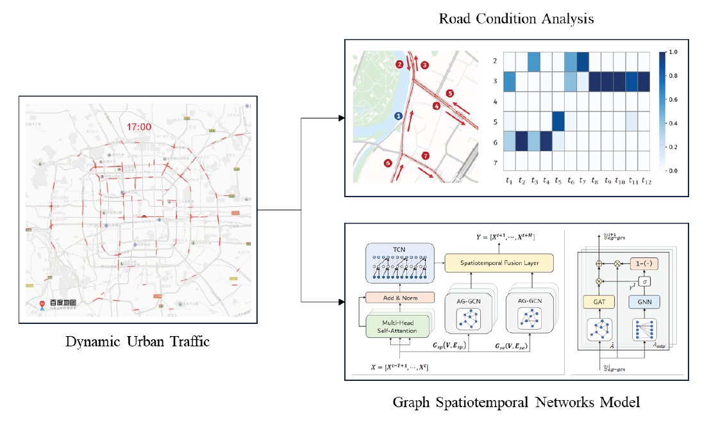

[English Version](../.)

## 关于我

我是卢彬，现在于[上海交通大学](http://sjtu.edu.cn/)[智能物联网研究中心](http://iiot.sjtu.edu.cn/)就读研一，我的导师是[甘小莺](http://iwct.sjtu.edu.cn/Personal/xygan/index.htm)副教授，研究方向包括时空数据挖掘、图神经网络与群智感知等。

### 教育经历
- 2016.09 ~ 2020.07 &nbsp; 本科 上海交通大学 电子信息与电气工程学院 信息工程（卓越工程师班） 上海市优秀毕业生
- 2020.09 ~ 2023.03 &nbsp; 硕士 上海交通大学 电子信息与电气工程学院 电子与通信工程（保研）

### 荣誉奖项
- 2018.05 &nbsp; 2018美国大学生数学建模竞赛 全球一等奖（Meritorious Winner） 指导教师[高晓沨](http://www.cs.sjtu.edu.cn/~gao-xf/)教授。

- 2019.08 &nbsp; 2019全国大学生物联网设计竞赛 全国一等奖/华东赛区特等奖 指导教师徐季旻高级工程师与[金海明](http://jhc.sjtu.edu.cn/~haimingjin/)助理教授。

- 2020上海市优秀毕业生 成长故事登上电子工程系微信公众号：[【我们的四年】卢彬：一步一遥，奋力奔跑！](https://mp.weixin.qq.com/s/B_4YIu3GbaOZ2MFFFHhpzg)

- “三好学生”称号（2017.10；2019.10），“优秀学生干部”称号（2018.10），“优秀团员”称号（2017.05），上海交通大学优秀学生奖学金（3次）

### 实习经历
- 2020.04 ~ 2020.08 &nbsp; 字节跳动 中国区广告投放策略中台 商业产品经理实习生 [为什么从“技术”转“产品”](why_rd2pm.html)
> 1.**中台能力建设**：负责8个行业多模态（CV+NLP）广告内容理解营销卖点标签与视频叙事标签中台能力建设，行业覆盖率由60%提升至90%+，准召率85%+。与行业运营共同优化标的分类体系，输出细粒度商品推广物拆分能力，并应用于对内/对外广告投放诊断工具中。

	> 2.**应用赋能输出**：将广告内容理解能力应用至抖音、今日头条、穿山甲等多个端的策略（频控、dislike、特征进CTR/CVR/付费率模型、相似广告召回等）与端样式展示（信息流广告蒙层、营销子链），通过A/B实验验证实现正向收益；从0到1参与广告内容理解平台的5个板块产品设计，推进中台能力可视化、高可用。
- 2019.06 ~ 2020.01 &nbsp; 英特尔亚太研发有限公司 边缘计算算法实习生 因参与[“基于边缘计算网关的新能源充电桩无感支付平台”项目](https://www.linkedin.com/feed/update/urn:li:activity:6597420430355718144/)入围OpenInfra主旨演讲与Demo展台荣获[2H'2019杰出实习生](https://www.linkedin.com/feed/update/urn:li:activity:6606044330564128768/)（16/400+）
> 1.**英特尔2H'2019杰出实习生（16/400+）**，负责OpenStack基金会边缘计算IaaS顶级开源项目StarlingX DevOps工作，在开源社区提交20+patch。协助提供自动化健全测试、机器学习测试与3项性能测试方法并移交全球测试团队进行长期测试。

	> 2.负责与中国银联合作的基于边缘计算网关的新能源充电桩无感支付平台项目的开发，搭建边缘基础设施，实现软件与硬件架构原型设计。**目入选2019开源基础设施峰会OpenInfra主旨演讲与Demo展台**，作为负责人在峰会期间接待全球与会人员。
- 2019.01 ~ 2019.03 &nbsp; 德勤华永会计师事务所 风险咨询 信息技术审计与鉴证实习生
> 1.利用SQL和Python对某汽车零部件龙头企业4家子公司的4000万条会计分录进行数据清洗与JET测试。对某汽车龙头企业2018年超过200万条经销商销售记录进行数据分析与数据可视化。

	> 2.协助完成4家客户的IT审计业务，完成多个ERP系统的GITC测试和超过20份底稿撰写，并与企业IT负责人保持沟通、资料索取、访谈与IT审计测试。
- 2018.07 ~ 2018.08 &nbsp; 共青团上海市普陀区委员会 挂职锻炼
> 1.联络4家街道镇、区政府机关大口每周组织一场普陀区青少年升国旗暨爱国宣讲主题活动，参与小学生爱心暑托班等工作的组织筹备，接待时任副市长翁铁慧调研，承接上海市爱心暑托班总结工作的举行。

	> 2.负责2018年区团代会代表资料审核和访谈工作，参与团区委各部门各项工作，并作为大学生代表在结营仪式上做主题演讲。经考核，被评为2018年上海市高校优秀大学生暑期实践锻炼优秀学生。
- 2018.01 ~ 2018.02 &nbsp; 松下信息仪器（上海）有限公司 项目实习生
> 带领团队利用PDCA循环管理理论对改进治具提高“曲悦622”配线生产效率与优化WH4415/4615单品生产包装一体化项目进行精益生产分析，带领PESIESH获得当年近10家事业部项目实习生第二名的好成绩，并作为2018年优秀项目实习生代表在夏季项目进行分享。

### 发表著作
- **Bin Lu**, Xiaoying Gan, Haiming Jin, Luoyi Fu, Haisong Zhang, "Spatiotemporal Adaptive Gated Graph Convolution Network for Urban Traffic Flow Forecasting", *accepted by the 29th ACM International Conference on Information and Knowledge Management* (**CIKM 2020**). [\[paper\]](https://dl.acm.org/doi/10.1145/3340531.3411894)

### 项目经历
- 2019.03 ~ 2019.06 &nbsp; 爱立信 基于NB-IoT的众包式移动气象站设计
> 使用Arduino Nano和多传感器进行气象数据感知，并利用NB-IoT技术和华为云OceanConnect平台进行数据上报和下发实现完整业务流程，编写Web界面进行数据可视化与数据分析平台，解决了众包场景下的广域低时延物联网解决方案。
- 2019.03 ~ 2019.06 &nbsp; 英特尔 基于intel NCS的食物图像细粒度分类与边缘推断
> 基于集成学习训练ResNet, DenseNet和VGGnet等多种网络结构，并设计attention module的深度学习算法实现iFood2019数据集细粒度图像分类，并利用英特尔神经计算棒NCS实现低算力终端低时延高可靠的人工智能推断部署，准确率排名居Kaggle榜单前15%。
- 2018.10 ~ 2018.12 &nbsp; 乐鑫   基于ESP32单片机的智能自平衡小车设计
> 自购电机、编码器、陀螺仪及传感器组装小车，利用Altium Designer绘制电路PCB板并外发加工。编写与调试PID自平衡算法，利用物联网开发平台Blinker实现对小车的手机APP控制，实现小车循迹、走迷宫、避障等功能。
- 2018.10 ~ 2018.12 &nbsp; 基于模仿学习训练神经网络投票式控制2048游戏 指导教师：[倪冰冰](https://ee.sjtu.edu.cn/FacultyDetail.aspx?id=102&infoid=66&flag=66)特别研究员
> 通过Python获取一个超强的2048游戏agent超过4000万局的棋盘数据，基于PyTorch学习框架训练3个CNN卷积神经网络或ResNet网络做投票式控制2048游戏的上下左右决策。单局游戏可稳定达到1200分以上，平均可达到1350分。（课程要求900分）

### 学生工作
- 2016.10 ~ 2019.05 &nbsp; 上海交通大学学生生涯发展协会（职协）SCDU会长
> 1.负责“普华永道”杯职业生涯规划大赛（两届，含首创第一届），“字节跳动”杯模拟求职大赛，“雏鹰杯”案例分析大赛两届，累计报名人数超过300人，决赛观众超过500人。

	> 2.联络校内近20家校企联合俱乐部，联络校外企业方超过110人，组织企业走访8次，职业技能培训6场，校企嘉年华2场，暑期实习生招聘会2次。参与C9高校职协峰会1次，组织C9联合活动2场。

	> 3.首创第一届“星计划”新生成长训练营，报名人数超过200人，邀请6位交大校友担任导师。建立协会“家文化”建设，推进部门制+项目组制的“矩阵化”管理模式，强化复盘意识，聚合校内外校友资源。

- 2019.10 ~ Present &nbsp; 上海交通大学行业研究协会成员

### 志愿者经历
- 2017.07 ~ 2017.08 &nbsp; “思源公益”云南洱源二中支教团成员

