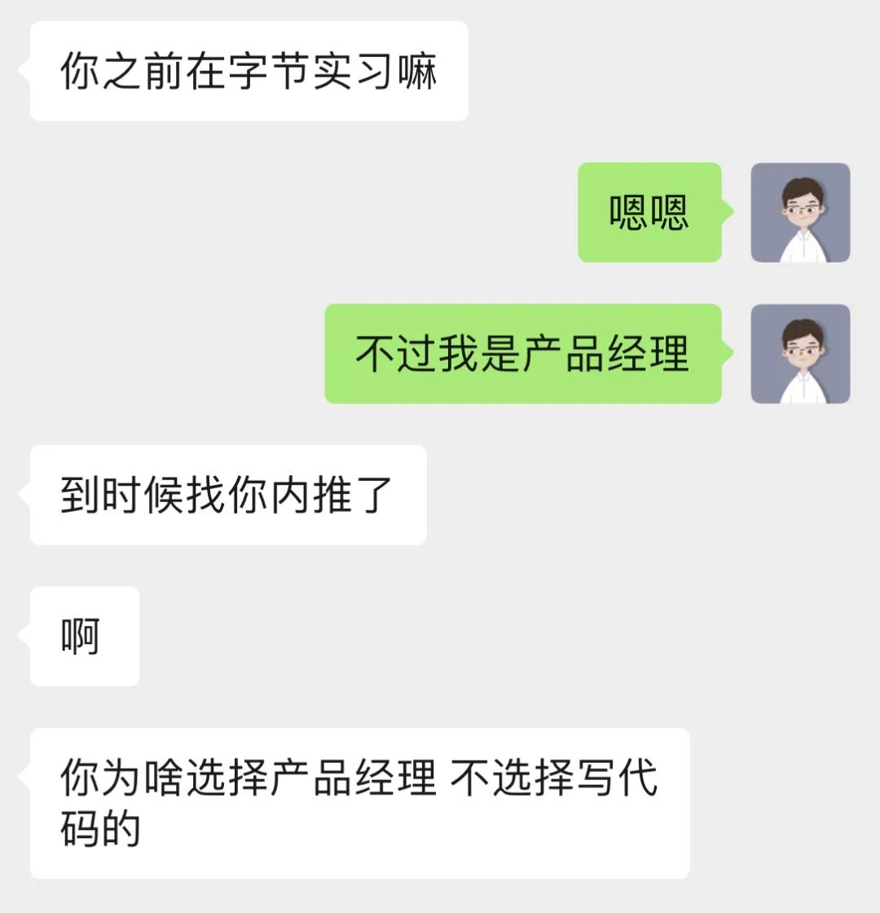
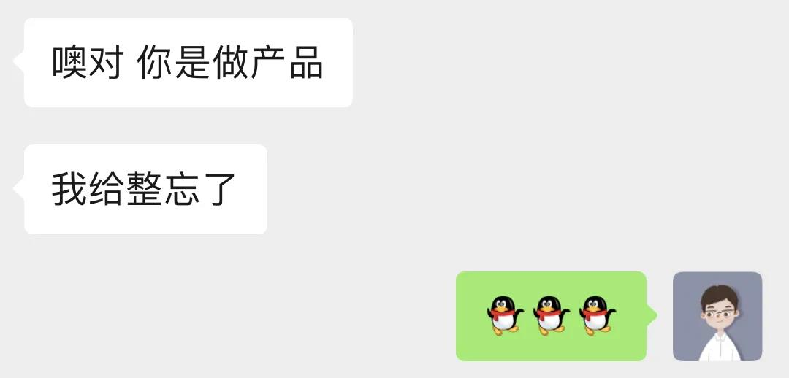
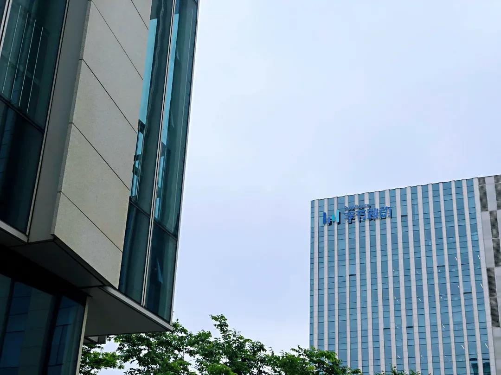
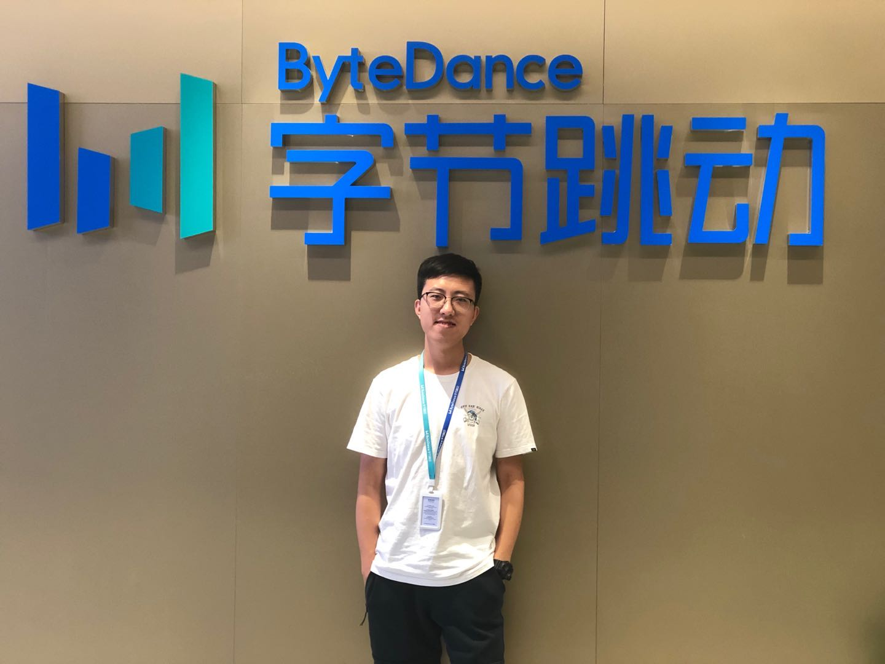

## 为什么从技术转产品

昨天晚上和公司的小伙伴一起在捞王聚餐，下周一再去公司还个电脑、办好离职手续，我在字节跳动实习的四个月就告一段落了。说好的，要写一个小作文聊一聊我的第一份产品实习经历，昨晚回到家就一直在想定什么题目好呢？

于是，想到了这个从面试、入职再到离职，不断被各种人问到的问题——“为什么你要做产品经理？”，“为什么不做技术？”，“为什么选择从技术转产品？”。结合我过去成长经历的思考以及在字节跳动实习的四个月时光，我想认真回答一下这个问题。

其实从进大学后不久，我就觉得自己更适合与人打交道的工作、喜欢去承担挑战与解决问题。当我深入地在交大职协工作了一年半，我就开始思考职协在交大这个科研氛围浓郁的大环境中的发展应该怎么去做；希望挖掘同学职业发展的直接需求，并从0到1地做一个新项目，并考虑这个项目能带给这个学生组织什么收益。回过头来看，我觉得自己身上不少特质都非常契合产品经理的定位。现在很多求职公众号，对产品经理这个角色有点妖魔化，高阶产品可能确实在高屋建瓴地说生态、说愿景，而我认为在初级产品的阶段，**产品经理就是一个拥有多维能力、能够不断解决问题的人。**那首先就要说说什么是互联网产品，我自己理解，互联网产品就是利用互联网技术去满足一部分人的需求并为企业实现收益的商业形态。而产品经理作为一个产品最直接的owner需要与算法、开发、测试、运营、法务、销售等各团队合作，共同助推这个产品的实现、落地与演进。在这个过程当中，产品经理往往承担了最大“背锅侠”的角色，毕竟竞品分析、产品定位、需求拆解、项目管理、产品上线、布道推广等一系列的流程都是产品经理一路做下来的，如果你觉得你是一个愿意承担责任的人，有很强的主人翁精神，那你离产品经理很近了；对应到大学校园中，如果你愿意并能较好地在课程小组作业中担任小组长、在学生工作中做一个项目的负责人，去协调各个同学的工作并共同完成好这个项目，那你很有戏可以成为一个产品经理。

这么说来，产品经理是不是就是没有门槛的呢？相较于互联网技术岗，需要有很强的代码能力或者一些算法、技术研究岗需要有高水平论文发表这些比较明确的要求，产品经理似乎确实很难罗列出一二三条的限制，但是这个岗位对能力的要求其实是挺高的。**首先便是对业务的理解。**初级技术可以对业务零了解，因为产品经理已经把业务需求拆解为了一个技术问题去给RD实现了，但是产品最重要的就是懂业务，到底我们是这个商业形态中的哪一环，我们的上下游关系是什么，我们充当了一个什么样的角色，我的产品能力能够给公司带来什么价值，业界竞品都在做些什么......对于产品业务的思考是对产品经理一个非常大的挑战，在进入公司之初我对于互联网广告业务是完全不懂的，待了四个月也只能说对于我们自己负责的这一小环节有了自己的一些想法，因此产品第一要求就是快速学习与理解业务的能力。**其次，沟通能力非常重要。**产品经理在公司中经常就是开会、开会、开会，如何和对技术完全不懂的运营聊实现，如何和对业务不理解的技术聊场景，如何让不同性格和做事方式的人都能愿意听你说话其实不是一件容易的事情。同时，大家出于对产品经理“背锅侠”角色的定位，你说的每一句话、在文档中写的每一个字可能都会成为他们未来批判你的证据。因此，准备充分、思考深入后的沟通和一次次的目标对齐是非常重要的。**第三，就是什么事你都得会一些。**说了两个比较大的方面，一是懂业务，二是会沟通，除此之外，产品经理也要会写sql、做数据分析、画产品原型图、懂一些技术实现、看得懂研报、文字表达能力强、会画图和做presentation等等。因此，产品经理绝不是一个很容易去做的工作。

那么我，一个信息工程专业的学生，所谓的从“技术”转“产品”的优势是什么呢？在学校里，四年来的专业学习让我对各种计算机的技术能力了解的还是比较多的，尤其是和人工智能相关的技术我也有过不少的实操经验。在字节跳动这个样样都deep learning的公司，我觉得自己相较于不懂技术的产品还是有一些优势的。我负责的策略中台业务叫做广告内容理解，其实就是利用多模态机器学习（CV+NLP）的能力去对字节跳动各类广告进行理解，这个理解从最粗的各种embedding（文本、图片、文本+图片），到分类（粗粒度与细粒度的各级分类）、再到标签（从多个维度进行白盒化拆解）都有涉及。因此在中台能力建设的过程中，我和算法的合作是非常多的，在我刚进公司的时候我就立马理解了我们业务的基础能力是什么，以及大概的技术实现手段有什么，和算法沟通技术能力和评价指标的时候大家处于一个相同的话语体系，非常的顺畅。除了中台能力建设，更重要的是应用赋能输出，在这个过程中我也会和很多别的团队的技术进行沟通，例如我们想做一个平台，就涉及到了网页的前后端开发，在学校里我也做过网页开发，因此在画原型图的同时我会同步思考一下技术实现，提前写好需要我们团队工程同学准备的接口和数据落表；我还对接了特征进模型，这就是一个更技术的应用了，虽然我们产品不需要特别理解这个特征是怎么落的，但是你至少需要理解这些特征是怎么处理的，加到了用户侧、广告侧还是match侧等等。我们大团队还涉及到了广告投放的一些基础策略，涉及到了我导师曾经比较喜欢做的方向网络经济学相关的知识，虽然很可惜我对于VCG拍卖和各种定价机制基本已经忘得差不多了，但是我至少知道大家都在说些什么，不会太觉得云里雾里。更有趣的就是我们有一次在讨论meta learning的应用，我和我们的数据科学家一拍即合，觉得可以将元学习应用于冷启动当中去。因此，在技术驱动的互联网公司，对技术的了解帮助了你更快速取得和技术的信任与合作关系，虽然网络上一直说产品和技术是“相爱相杀”，但是其实如果能够“相亲相爱”岂不是更棒，并给自己一个最低要求就是千万不要拍脑袋完全不管技术实现去给RD提需求。除此之外，因为我给自己的职业定位是策略产品或商业产品，所以相较于用户产品，我们需要非常多的数据分析，因此我也很享受通过跑sql、写简单的python程序去用数据支撑快速验证我的想法和猜想。

最后要说一下我对职业发展的思考。前几天，我和导师在武汉出差，在吃饭的时候我导师聊到了对培养学生的思考，她觉得一个优秀的硕博士学生就要**做得到“单点突破”，也要能“由点及面”**。所谓的“单点突破”，就是能够深挖一个感兴趣的领域，并且在一个小方向上能够做出自己的思考和工作。所谓的“由点及面”就是也要能从这个点跳的出来，看看更广阔的大方向、大领域的研究进展，能及时follow。具体来说，我自己想做的是图神经网络相关的研究，而我们实验室的大方向可能包括了从大数据、知识图谱到群智感知、资源分配与任务调度等等多个方向。我很认同我导师的话，我觉得产品经理就是一个能“单点突破”又能够“由点及面”的工作岗位，去锻炼自己多元的不同方面的能力，这也更让我觉得产品经理这个岗位对我而言更有趣也更有挑战性。

我们每个人做职业选择的时候考虑的点都不尽相同，我依旧很热爱技术的纯粹，我也很享受去阅读技术论文、讨论技术路线时的专注与收获，可能正是出于我对技术的热情，我希望把这些powerful的技术能力赋能到实际的业务场景中去，发挥它更大的效能。从“技术”转“产品”的想法不是一蹴而就的，其实回过头来自己的每一个目标好像都在慢慢往这个方向靠近，也很幸运自己在0产品经验的时候能够直接到字节跳动这样的大厂来实习。字节是一家很棒的公司，身边合作的同事都非常nice，虽然现在字节的国际化业务遇到了挺大的挑战，但是我真诚的祝福它可以尽快的应对好难题。在我的交接文档里专门辟出了一章是致谢，真的很感谢和我合作的各位同学，相逢的人会再相逢，期待我们的下一次再见！

更欢迎有缘读到这篇推送并有志于担任产品经理的同学和我多多交流与讨论~

[back](../README.html)

